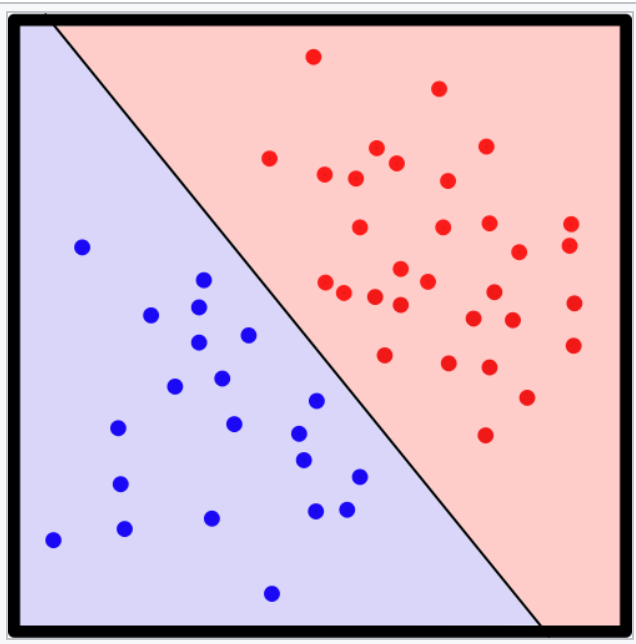

# memo

## 人工ニューロン

決定関数$\sigma(z)$
$$
\sigma (z) =
  \begin{cases}
    1 & \quad (z \geq \theta) \\
    0 & \quad (z \lt \theta)
  \end{cases}
$$

入力値$x$
$$
x=
  \begin{bmatrix}
    x_{1} \\
    \vdots \\
    x_{m}
  \end{bmatrix}
$$

重みベクトル$w$
$$
w=
  \begin{bmatrix}
    w_{1} \\
    \vdots \\
    w_{m}
  \end{bmatrix}
$$

総入力(net input)$z$
$$
z = w_{1}x_{1}+w_{2}x_{2}+ \cdots + w_{m}x_{m}
$$

単純化のために、バイアスユニット$b = -\theta$を導入
$$
z = w_{1}x_{1}+w_{2}x_{2}+ \cdots + w_{m}x_{m} = \mathbf{w}^{T}\mathbf{x} + b
$$

決定関数(再定義)$\sigma(z)$
$$
\sigma (z) =
  \begin{cases}
    1 & \quad (z \geq 0) \\
    0 & \quad (z \lt 0)
  \end{cases}
$$

## パーセプトロンの学習規則

1. 重みとバイアスユニットを0または値の小さい乱数で初期化する
2. 訓練データ$x^{(i)}$ごとに次の手順を実行する。
   1. 出力値$\hat{y}^{(i)}$を計算する。
   2. 重みとバイアスユニットを更新する。

重みとバイアスユニットの更新
$$
w_{j} := w_{j} + \Delta w_{j} \\
b := b + \Delta b
$$

更新値
$$
\Delta w_{j} = \eta ( y^{(i)} - \hat{y}^{(i)})x^{(i)}_j \\
\Delta b = \eta ( y^{(i)} - \hat{y}^{(i)})
$$
$\eta$: 学習率(learning rate: $0 \lt \eta \leq 1$)
$y^{(i)}$: $i$番目の訓練データの正解の値
$\hat{y}^{(i)}$: $i$番目の訓練データの予測値

(例)2次元データセットに対する更新

$$
\Delta w_{1} = \eta ( y^{(i)} - \mathbf{output}^{(i)})x^{(i)}_1 \\
\Delta w_{2} = \eta ( y^{(i)} - \mathbf{output}^{(i)})x^{(i)}_2 \\
\Delta b = \eta ( y^{(i)} - \mathbf{output}^{(i)})
$$

正解の値を正しく予測できた時、重みは更新されない。
$$
y^{(i)} = 0,  \hat{y}^{(i)} = 0, \Delta w_{j} = \eta(0-0)x^{(i)}_j = 0,\Delta b = \eta ( 0 - 0) = 0
$$

間違った値を予測した場合、目的クラスに向かうように重みが計算される。
$$
y^{(i)} = 1,  \hat{y}^{(i)} = 0, \Delta w_{j} = \eta(1-0)x^{(i)}_j = \eta x^{(i)}_j,\Delta b = \eta ( 1 - 0) = \eta
$$

パーセプトロンの収束が保証されるのは、２つのクラスが線形分離可能である-線形の決定境界で完全に分離できる場合のみ。
線形分離できない時、
- 訓練の最大回数(エポック)や、誤分類の最大数を設定する。
- ADALINEのアルゴリズムを使うことで収束する。

### 線形分離可能

- Linearly separable
- Wikipedia: 幾何学において、２つの集合が二次元平面上にある時、それらの集合を一本の直線で分離できること。

- 正確な定義: 2つのカテゴリに属するパターンの集合が、ある超平面によって2つのカテゴリそれぞれに分離される時、このパターン集合は線形分離可能であるという。
  - 超平面: n次元空間内にある(n-1)次元空間
